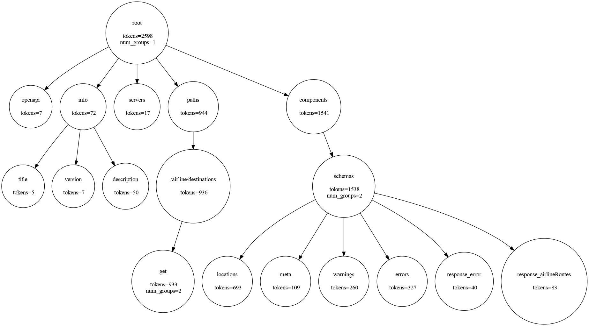

# tree-splitter-llm

A tree builder and a token-based node grouping algorithm for a JSON file, that can be used later for LLM tasks.

## How does it work?

A tree structure will be built first from the input JSON file. Then, based on the user defined `max_tokens` variable, nodes are grouped, satisfying that the number of tokens in each group is always `<= max_tokens`. Algorithm details can be fround [here](./tree_splitter_llm/utils.py).

As an output, the built tree will have an attribute called `grouped_children_keys` indicating the children nodes that are grouped together.

## Run an example
### Env initialization
Install [uv](https://docs.astral.sh/uv/getting-started/installation/) beforehand and create the environment:
```bash
$ uv venv -p python3.12
$ uv sync
$ source .venv/bin/activate
```

### And run the main script
Inside the examples folder, you can find a [json example](./example/airline_routes_swagger.json).

```bash
$ python main.py --filename [path to json file] --model [llm model for the tokenizer] --token-number [max token number of the groups] --display-tree
```
This command wll build a tree from the given file and compute the tokens of each child. Additionally, it will create node groups based on a defined token limit (it will default to 1/3 of the total file length in case the arg is not provided). When `--display-tree` flag is set, a plot with some tree nodes is saved in the project folder. It should look like this:

